  

###

  
  
  
  

###

  

###

###

<h3 align="left">👩‍💻  About Me</h3>

###

 🔭Recentemente atuo como Fundador e C.E.O na Quadar Inshallah Co. & Records - 📚 Estou aprendendo Java, Deploys com CDN, clusters e russo. - ⚡ No meu tempo livre gosto de ler, estudar, escrever, jogar games, assistir filmes, séries e praticar atividades físicas como boxe e corrida.

###

## 🚀 Principais Projetos

<table>
  <tr>
    <td width="50%">
      <h3>🛍️ Quadar Inshallah Store</h3>
      

        E-commerce fullstack com React, Node.js, MongoDB, autenticação JWT e Stripe.
      

      

        <b>Tecnologias:</b> React • Node.js • MongoDB • TailwindCSS • JWT • Firebase • Cloud • Jest
      

      <a href="https://github.com/rootmannwright/quadar_inshallah_store">
        🔗 Ver repositório
      </a>
       
      <strong>Tags:</strong>
    </td>
    <td width="50%">
      
    </td>
  </tr>
  <tr>
    <td width="50%">
      <h3>🛍️ Quadar Inshallah Headshop</h3>
      

        E-commerce fullstack com Java, SpringBoot, MySQL, e Stripe.
      

      

        <b>Tecnologias:</b> Java • Spring • SpringBoot • React • JWT • MySQL • Firebase • OAuth • TailwindCSS
      

      <a href="https://github.com/rootmannwright/quadar_inshallah_headshop">
        🔗 Ver repositório
      </a>
       
      <strong>Tags:</strong>
    </td>
    <td width="50%">
      
    </td>
  </tr>
</table>

<h3 align="left">🛠 Language and tools</h3>

###

  
  
  
  
  
  
  
  
  
  
  
  
  
  
  
  
  
  
  
  
  
  
  
  
  
  
  
  
  
  
  
  
  
  
  
  
  
  
  
  
  

###

<h3 align="left">🔥   My Stats :</h3>

###

  

<h2 align="center">📊 GitHub Stats</h2>

 

###

<picture>
  <source media="(prefers-color-scheme: dark)" srcset="https://raw.githubusercontent.com/rootmannwright/rootmannwright/output/pacman-contribution-graph-dark.svg">
  <source media="(prefers-color-scheme: light)" srcset="https://raw.githubusercontent.com/rootmannwright/rootmannwright/output/pacman-contribution-graph.svg">
  
</picture>

###
